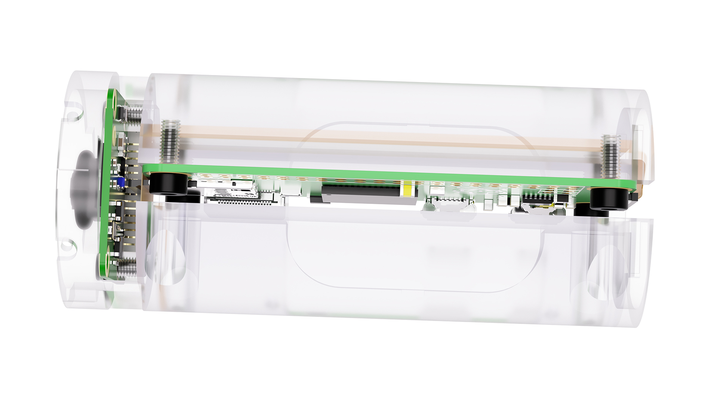
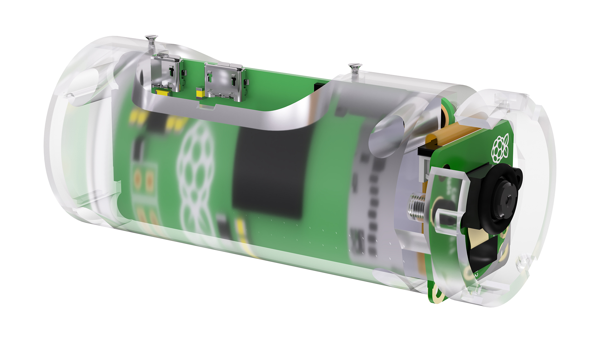

# PiSight

Why would one put a Raspberry Pi into an Apple iSight? Find out [on Medium](https://pisight.camera). In this repo, you can find the info to build your own PiSight.

## Hardware

| Part | Info | Price (2020) |
| :- | :- | -: |
| [Apple iSight](http://www.minimallyminimal.com/blog/apple-isight) | Available new and used on eBay | [$15 to 150](https://www.ebay.com/sch/i.html?_nkw=Apple+iSight) |
| [Raspberry Pi Zero](https://www.raspberrypi.org/products/raspberry-pi-zero/) | The [W](https://www.raspberrypi.org/products/raspberry-pi-zero-w/) version adds Wifi, which makes working with it easier and opens it up to more applications | [$5](https://www.adafruit.com/product/2885) or [$10](https://www.adafruit.com/product/3400) |
| [Raspberry Pi Camera V2](https://www.raspberrypi.org/products/camera-module-v2/) | Supports 1080p@30 or 720p@60, at a 62° horizontal field of view | [$29.95](https://www.adafruit.com/product/3099) |
| M2.6 screws | 4 of M2.6 x 0.45 mm Thread, 6 mm long | [$9.26 for 25](https://www.mcmaster.com/91290A073/) |
| M2 screws | 2 of M2 x 0.4 mm Thread, 4 mm long | [$13.28 for 100](https://www.mcmaster.com/91290A011/) |
| O-ring | Covers the gap around the lens | [$6.16 for 50](https://www.mcmaster.com/9262K562/) |
| Raspberry Pi Zero camera cable | A few options, but the 15 cm long narrow ones seem to work best | [$3.49](https://www.waveshare.com/raspberry-pi-zero-v1.3-camera-cable.htm) |
| Micro-USB cable | Many options, just need to fit the iSight adapter | [$8.99](https://www.amazon.com/Anker-Powerline-Micro-USB-Smartphones/dp/B012VZT5IO/) |
| 3D-printed frame | Use [`PiSight.stl`](PiSight.stl) or [`PiSight.step`](PiSight.step), cost varies significantly depending on material quality | [$50 to $200](https://www.fictiv.com) |

## Software

The PiSight camera implements the [UVC standard](https://en.wikipedia.org/wiki/USB_video_device_class) via the [Gadget API](https://www.kernel.org/doc/html/latest/driver-api/usb/gadget.html), which turns the Raspberry Pi and camera into a plug-and-play USB webcam. I used the instructions in [David Hunt](https://github.com/climberhunt)'s [blog post](http://www.davidhunt.ie/raspberry-pi-zero-with-pi-camera-as-usb-webcam/), with a few modifications in [my own fork](https://github.com/maxbbraun/uvc-gadget) of `uvc-gadget`.

I consolidated these steps into a [setup script](setup.sh), so you should be able to simply run `sudo setup.sh` after installing [Raspberry Pi OS](https://www.raspberrypi.org/downloads/raspberry-pi-os/) and enabling the camera and serial interfaces.
